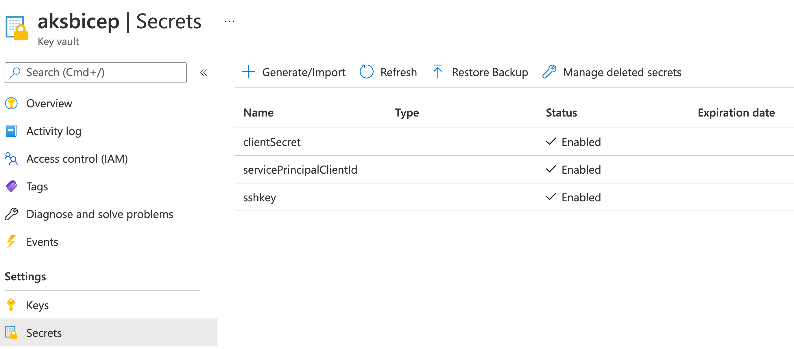

## aksbicep

An example to create an AKS cluster with secrets from Azure Key Vault with Bicep and GitHub actions.  Once the cluster is created, the workflow will apply `manifests/deployment.yml` that's a pre-created image.

[Bicep](https://cda.ms/2nH) is a domain-specific language (DSL) that uses declarative syntax to deploy Azure resources. It provides concise syntax, reliable type safety, and support for code reuse. We believe Bicep offers the best authoring experience for your infrastructure-as-code solutions in Azure.

[GitHub Actions](https://cda.ms/2nJ) helps you automate your software development workflows from within GitHub. You can deploy workflows in the same place where you store code and collaborate on pull requests and issues.

[Azure Key Vault](https://cda.ms/2nK) protects cryptographic keys, certificates (and the private keys associated with the certificates), and secrets (such as connection strings and passwords) in the cloud.

[Azure Kubernetes Service](https://cda.ms/2Kk) Easily define, deploy, debug, and upgrade even the most complex Kubernetes applications, and automatically containerize your applications. Use modern application development to accelerate time to market.


## Pre-requisites 

* An [SSH public key](https://cda.ms/2nD).

* Fork this repository so you can run GitHub Actions

* [Sign up for Azure, $200 free credit](https://cda.ms/2kz)

* Clone the fork locally or in your Azure Cloud Shell.


## Deployment

* Create an [Azure Resource Group](https://cda.ms/2nG)

`az group create -n <rg name> --location <region>`

* Get your subscription ID

`az account list --query "[?isDefault]"`

* Follow the ["Generate deployment credentials"](https://cda.ms/2kx) and ["Configure the GitHub secrets"](https://cda.ms/2ky) of this guide.  Create secrets in the repo for `AZURE_CREDENTIALS`, `AZURE_RG`, and `AZURE_SUBSCRIPTION` to connect your Azure account to the GitHub repo for actions to run.

`az ad sp create-for-rbac --name {myApp} --role contributor --scopes /subscriptions/{subscription-id}/resourceGroups/{MyResourceGroup} --sdk-auth`

* [Create a Key Vault](https://cda.ms/2kB)
`az keyvault create --name "<your-unique-keyvault-name>" --resource-group "myResourceGroup" --location "EastUS"`


* [Store your credenitals `sshRSAPublicKey`,`servicePrincipalClientId`, and `servicePrincipalClientSecret` parameters as secrets.](https://cda.ms/2kC) These secrets will have your SSH keys to access the cluster nodes for troubleshooting, your Azure subscription ID, and your Service Principal credentials.
```
az keyvault secret set --vault-name "<your-unique-keyvault-name>" --name "sshRSAPublicKey" --value "rsa-ssh etc etc etc"
az keyvault secret set --vault-name "<your-unique-keyvault-name>" --name "servicePrincipalClientId" --value "<output from service principal creation>"
az keyvault secret set --vault-name "<your-unique-keyvault-name>" --name "servicePrincipalClientSecret" --value "<output from service principal creation>"
```



* Update [azuredeploy.parameters.json](https://github.com/jaydestro/aks_bicep_template/blob/main/azuredeploy.parameters.json) with `uniqueclustername`, `dnsPrefix`, `sshRSAPublicKey`, `servicePrincipalClientId`, and `servicePrincipalClientSecret` details. 

```
 "id": "/subscriptions/{subscriptionID}/resourceGroups/{resource group}/providers/Microsoft.KeyVault/vaults/{keyvault name}"
```


Set the environment variables on the `.github\workflow.json` file to your cluster name, resource group, kubernetes namespace, and application name.

Example:

```
  CLUSTER_NAME: voteappprod
  CLUSTER_RESOURCE_GROUP: aksbicep
  NAMESPACE: voteappprod
  APP_NAME: voteappprod
  ```

When you commit to the main branch, it will kick off a build.  You'll get an AKS cluster with a service principal.  You can add custom names and features to the parameters file.  

Finally the `manifests/deployment.yml` file is loaded which provides you with the [Azure Voting App](https://github.com/Azure-Samples/azure-voting-app-redis), a Python/Flask app with Redis as your data component.

To access your public IP from the loadbalancer:

```
az aks get-credentials --name voteappprod --resource group <resource group name>

kubectl get services --all-namespaces
```

Your output should be something like this:

```
NAMESPACE     NAME                             TYPE           CLUSTER-IP     EXTERNAL-IP    PORT(S)         AGE
default       kubernetes                       ClusterIP      10.0.0.1       <none>         443/TCP         47h
kube-system   healthmodel-replicaset-service   ClusterIP      10.0.228.13    <none>         25227/TCP       47h
kube-system   kube-dns                         ClusterIP      10.0.0.10      <none>         53/UDP,53/TCP   47h
kube-system   metrics-server                   ClusterIP      10.0.212.100   <none>         443/TCP         47h
voteappprod   azure-vote-back                  ClusterIP      10.0.62.6      <none>         6379/TCP        47h
voteappprod   azure-vote-front                 LoadBalancer   10.0.19.38     1.2.3.4   80:30305/TCP    47h
```


## With Azure CLI

You can execute the following command in the root of the directory with an autheticated Azure CLI.

This example creates a resource group then creates a deployment with ARM.

```
az login 

az group create -n <resource group name> -l <location>

az deployment group create  --name <deployment name>  --resource-group <resource group name> --template-file aks.bicep --parameters='@azuredeploy.parameters.json'

az aks get-credentials --name voteappprod --resource group <resource group name>

kubectl apply -f ./manifests/deployment.yml
```
