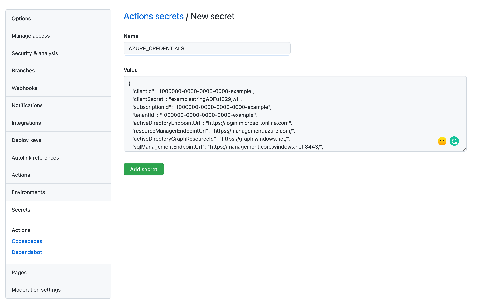
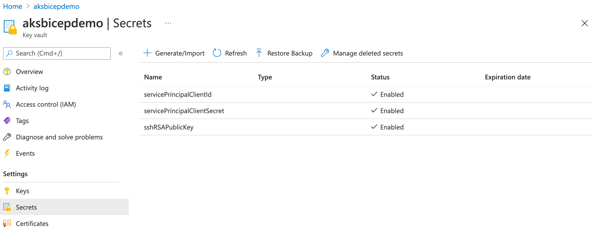
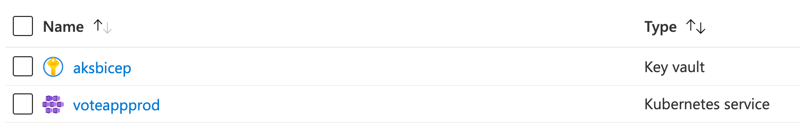
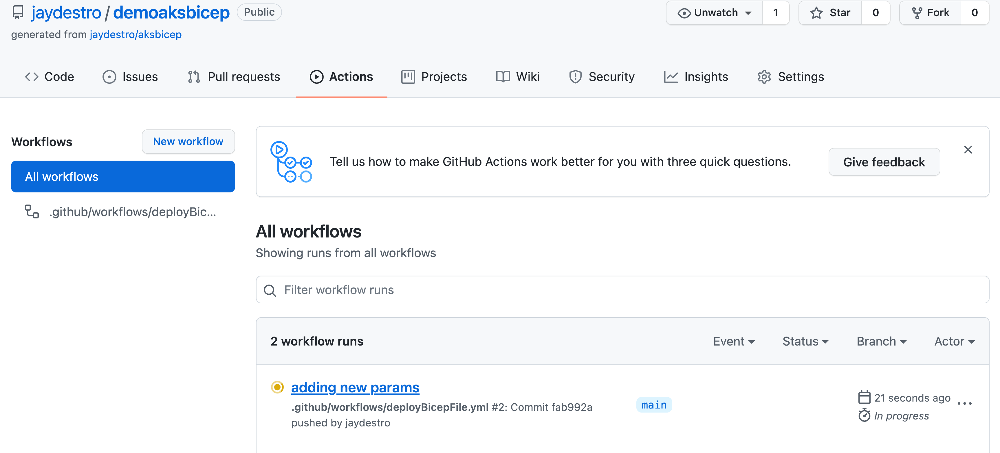
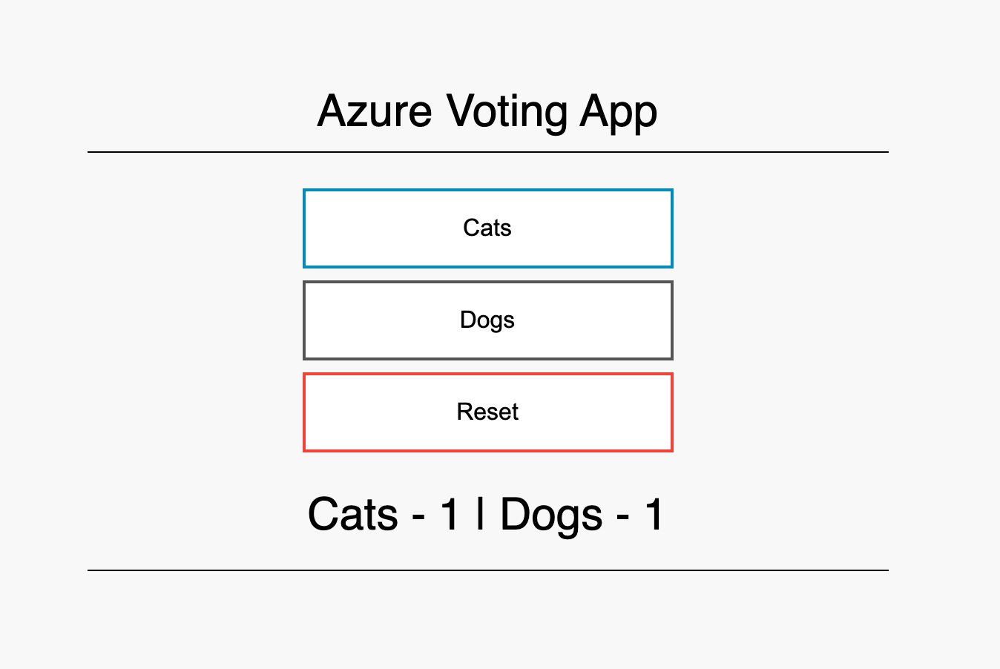

## aksbicep

An example to create an AKS cluster with secrets from Azure Key Vault with Bicep and GitHub actions.  Once the cluster is created, the workflow will apply `manifests/deployment.yml` that's a pre-created image.

[Bicep](https://cda.ms/2nH) is a domain-specific language (DSL) that uses declarative syntax to deploy Azure resources. It provides concise syntax, reliable type safety, and support for code reuse. We believe Bicep offers the best authoring experience for your infrastructure-as-code solutions in Azure.

[GitHub Actions](https://cda.ms/2nJ) helps you automate your software development workflows from within GitHub. You can deploy workflows in the same place where you store code and collaborate on pull requests and issues.

[Azure Key Vault](https://cda.ms/2nK) protects cryptographic keys, certificates (and the private keys associated with the certificates), and secrets (such as connection strings and passwords) in the cloud.

[Azure Kubernetes Service](https://cda.ms/2Kk) Easily define, deploy, debug, and upgrade even the most complex Kubernetes applications, and automatically containerize your applications. Use modern application development to accelerate time to market.

## Pre-requisites

* An [SSH public key](https://cda.ms/2nD).

To create a key:

`ssh-keygen -m PEM -t rsa -b 4096`

If you're not familiar with the format of an SSH public key, you can display your public key with the following cat command, replacing `~/.ssh/id_rsa.pub` with the path and filename of your own public key file if needed:
`cat ~/.ssh/id_rsa.pub`

* Use the template for this repository so you can run GitHub Actions

* [Sign up for Azure, $200 free credit](https://cda.ms/2kz)

* Clone the new template locally or in your Azure Cloud Shell.

## Deployment


* Get your subscription ID, set as a variable

```
SUBSCRIPTION=(`az account show --query "id" -o tsv`)
```

* Create a unique [Azure Resource Group](https://cda.ms/2nG). We're using this as a paramater for several portions of the workshop, so please ensure the name is unique.  For example `aksbicepcreate`

Shell enviroment variables:

```
LOCATION="eastus"
NAME="<uniquename>"
```

Create the RG in shell.

`az group create -n $NAME --location $LOCATION`

* Follow the ["Generate deployment credentials"](https://cda.ms/2kx) and ["Configure the GitHub secrets"](https://cda.ms/2ky) of this guide.  

`az ad sp create-for-rbac --name $NAME --role contributor --scopes /subscriptions/$SUBSCRIPTION/resourceGroups/$NAME --sdk-auth > sp.txt` 

This `sp.txt` file now contains your service principal credentials to login to your Azure account when running GitHub Actions.  Now to add them as secrets within the GitHub Secrets environment variables.

`AZURE_CREDENTIALS` is the output of `sp.txt`
`AZURE_RG` is your resource group name set in the `$NAME` variable.
`AZURE_SUBSCRIPTION` is the subscription ID in your `$SUBSCRIPTION` variable.

* Go to your GitHub repo you created from template. Click Settings, then click Secrets.
* Click "New Repository Secret"
* Create secrets in the repo for `AZURE_CREDENTIALS`, `AZURE_RG`, and `AZURE_SUBSCRIPTION` to connect your Azure account to the GitHub repo for actions to run.
* Paste the entire contents of the JSON generated for the service principal in `AZURE_CREDENTIALS`.  `AZURE_RG` and `AZURE_SUBSCRIPTION` should be single lines of both values. 



* [Create a Key Vault](https://cda.ms/2kB)

CLI

`az keyvault create --name "$NAME" --resource-group "$NAME" --location "$LOCATION" --enabled-for-template-deployment=true --enabled-for-disk-encryption --enabled-for-deployment`

or Portal

  * Click Create at top of resource group
  * Search for Key Vault
  * Click Create
  * Give a unique name in the Key vault name section
  * Click to "Access Policy" section and select the three tick boxes:

        ✔️ Azure Virtual Machines for deployment

        ✔️ Azure Resource Manager for template deployment

        ✔️ Azure Disk Encryption for volume encryption

  * Leave the rest as default
  * Click Review and Create

* [Store your credentials as secrets](https://cda.ms/2kC)

    `sshRSAPublicKey`,
    `servicePrincipalClientId`,
    and `servicePrincipalClientSecret`

    These secrets will have your SSH keys to access the cluster nodes for troubleshooting and your Service Principal credentials.

  * Create a secret to store `sshRSAPublicKey`
    * Go to your key vault
    * Click Secrets
    * Click Generate/Import
    * Create secret:
      * Name: sshRSAPublicKey
      * Value: output of your ssh key
    * Click create
  * Repeat steps for `servicePrincipalClientId` and `servicePrincipalClientSecret`



* Update [azuredeploy.parameters.json](https://github.com/jaydestro/aks_bicep_template/blob/main/azuredeploy.parameters.json) with  the name of your resource group to `uniqueclustername`, `dnsPrefix`.

Update the `sshRSAPublicKey`, `servicePrincipalClientId`, and `servicePrincipalClientSecret` details:

To let your template reference KeyVault secrets from parameters, update the `id` to point to the KeyVault you created earlier.

```json
 "id": "/subscriptions/{subscriptionID}/resourceGroups/{resource group}/providers/Microsoft.KeyVault/vaults/{keyvault name}"
```




Finally the `manifests/deployment.yml` file is loaded which provides you with the [Azure Voting App](https://github.com/Azure-Samples/azure-voting-app-redis), a Python/Flask app with Redis as your data component.  You do not need to make any changes here.

When you commit to the main branch, it will kick off a build.  You'll get an AKS cluster with a service principal.  You can add custom names and features to the parameters file.



To access your public IP from the loadbalancer:

```bash
az aks get-credentials --name $NAME --resource-group $NAME

kubectl get services --all-namespaces
```

Your output should be something like this:

```
NAMESPACE     NAME                             TYPE           CLUSTER-IP     EXTERNAL-IP    PORT(S)         AGE
default       kubernetes                       ClusterIP      10.0.0.1       <none>         443/TCP         47h
kube-system   healthmodel-replicaset-service   ClusterIP      10.0.228.13    <none>         25227/TCP       47h
kube-system   kube-dns                         ClusterIP      10.0.0.10      <none>         53/UDP,53/TCP   47h
kube-system   metrics-server                   ClusterIP      10.0.212.100   <none>         443/TCP         47h
voteappprod   azure-vote-back                  ClusterIP      10.0.62.6      <none>         6379/TCP        47h
voteappprod   azure-vote-front                 LoadBalancer   10.0.19.38     1.2.3.4   80:30305/TCP    47h
```


